# Project POST SYSTEM EXAMEN 
#System Documentation

The purpose of these documents is to provide an overview of the post system to a developer. 
It is assumed that the reader has a minimal understanding of a sales system 
and a system developer knowledge.

| Writer                | Date       | Version |
| :-------------------- | :--------: | ------: |
| Diego López          | 16/08/2021 | 1.0     |

## Índice
- [Payments Operation System Documentation](#payments-system-documentation)
    - [Índice](#%c3%8dndice)
    - [Overview](#overview)
    - [Architecture](#architecture)
    - [ABM Products](#ABM-products)
    - [ABM Customers](#ABM-customers)
    - [ABM Sellers](#ABM-sellers)
    - [Sale Operations](#sale-operations)
    - [Query all sales.](#query-all-sales)

## Overview

The system designed with the follow diagram. 

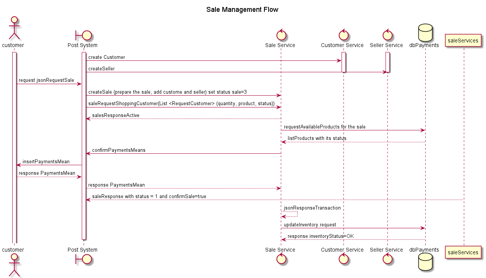

First, the customer sends jsonRequestSale, which contains a list of object requestCustomer with the attributes from Product required and quantity required, from now on the monolithic system will be called Post, create of sale transaction with objects customer and seller create previously created, along with the list requiredCustomer.

Once the sale is created, ask the DB if the required products exist, have an active status, and if there is enough inventory as required by the customer.

If there is at least one product enabled with stock to be sold, the sale confirmation process is requested, which in turn executes the call to request the payment to the post, filling in the jsonRequestSale the paymentType and if the amount enabled is greater than the total to pay, it returns a flag of confirmSale in true and updates the status of the sale from pending to active otherwise, it updates the status of the sale to inactive and ends the sale process with the customer.

If the sale is finalized, saleService asks the database to deduct the quantity sold from the Product inventory and the process ends there.

## Architecture

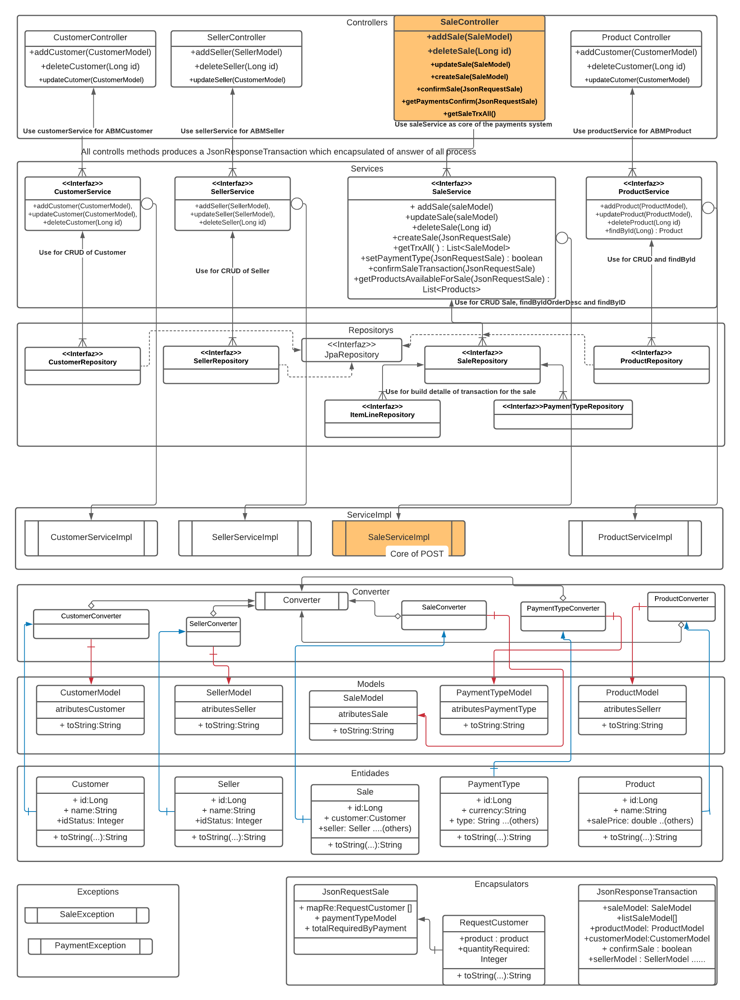

https://lucid.app/lucidchart/invitations/accept/inv_c3e27465-3e75-4941-9d01-8c53d5ae5fd2?viewport_loc=-61%2C1796%2C2291%2C941%2C0_0

The architecture is separate for levels, in the level highest have the controllers which using the services that correspond to each ABM, including SaleService what management all functions of the core of the payment system.

The most important classes that reflect the core of the operation were representing in another color.

All control methods produce a JsonResponseTransaction which encapsulated the answer of all processes. Except for getSaleTransactionAll() method what returns the query of all sales transactions executes.

The services are representing the interfaces that describe the contract to be executed by the classes that have the business logic for the post. Some interfaces use the level interface Repository to execute JPA queries to the DB.

However, The way it sends the data does it through the model of each class that is a representation of the entity, the conversion is done through the converter design pattern, so you can see the representation of an intermediate layer of converters between the models and entities, the input classes are shown in blue and the output classes in red.

Likewise, there is an encapsulation layer of the input and output JSON for the controllers and one of the exceptions that are only used in the saleServiceImpl.

Regarding the explanation of the core functionalities, it was explained in the Overview point of this document.

The following describes and shows the test of each method of the services through a Rest client.

##ABM Products

The Products Controller does 3 requested http: (post for add, put for update and delete for delete products), in the 3 of the required return a JSON JsonResponseTransaction, let's see the restClient examples .

###The request add Products.

Recibe an object productModel and response a JsonResponseTransaction across the request POST.
http://localhost:8080/payments/products/api/v1/add

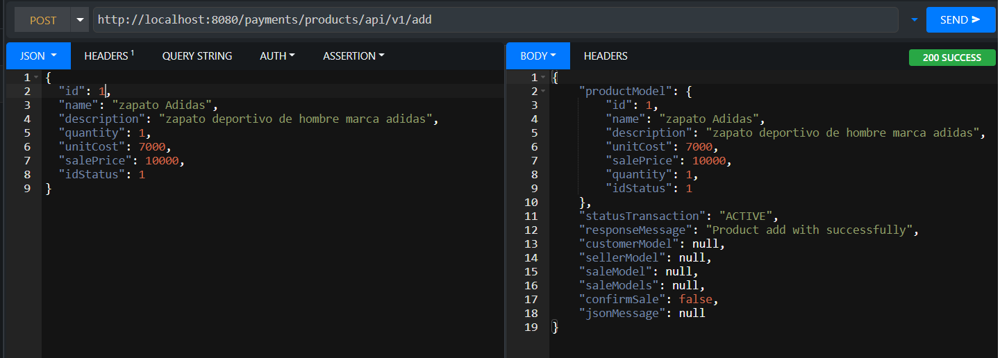

###The request update Products.

Recibe an object productModel and response a JsonResponseTransaction across the request PUT.
http://localhost:8080/payments/products/api/v1/update

###The request delete Products.

Recibe an id of type Long and response a JsonResponseTransaction across the request DELETE.
http://localhost:8080/payments/products/api/v1/delete

##ABM Customers

The Products Controller does 3 requested http: (post for add, put for update and delete for delete customers), in the 3 of the required return a JSON JsonResponseTransaction, let's see the restClient examples.

###The request add Customers.

Recibe an object customerModel and response a JsonResponseTransaction across the request POST.
http://localhost:8080/payments/customers/api/v1/add

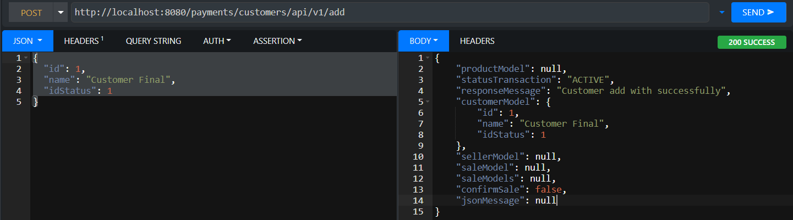

###The request update Customers.

Recibe an object customerModel and response a JsonResponseTransaction across the request PUT.
http://localhost:8080/payments/customers/api/v1/update

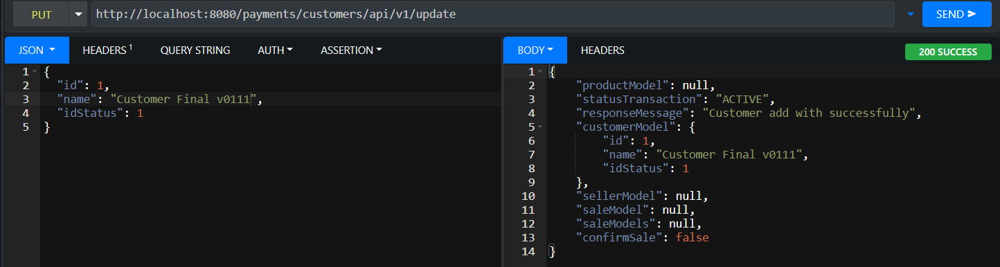

###The request delete Customers.

Recibe an id of type Long and response a JsonResponseTransaction across the request DELETE.
http://localhost:8080/payments/customers/api/v1/delete

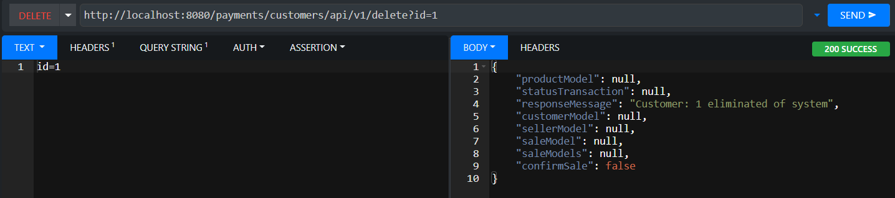

##ABM Sellers

The Sellers Controller does 3 requested http: (post for add, put for update and delete for delete sellers), in the 3 of the required return a JSON JsonResponseTransaction, let's see the restClient examples.

###The request add Sellers.

Recibe an object sellerModel and response a JsonResponseTransaction across the request POST.
http://localhost:8080/payments/sellers/api/v1/add

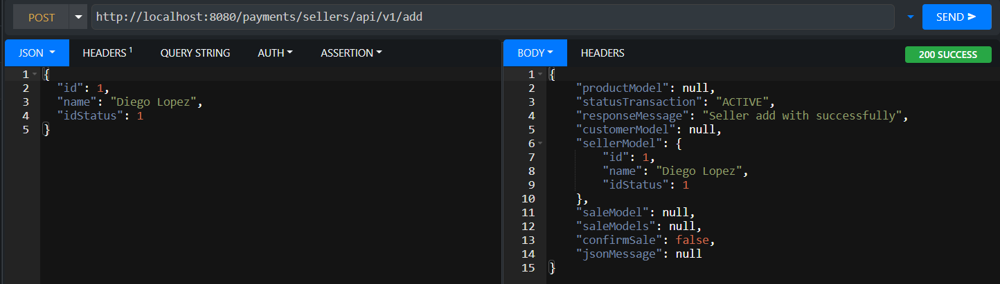

###The request update Sellers.

Recibe an object sellerModel and response a JsonResponseTransaction across the request PUT.
http://localhost:8080/payments/sellers/api/v1/update

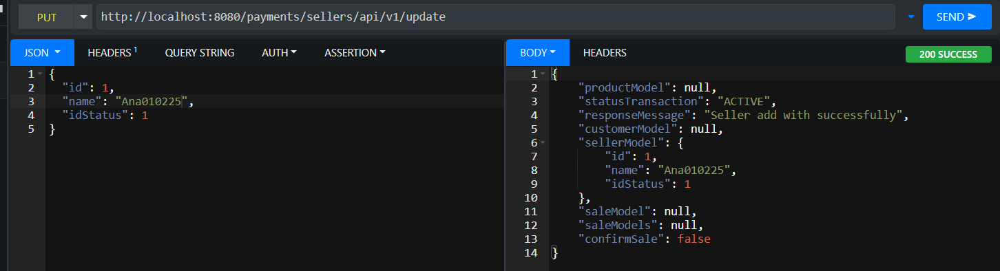

###The request delete Sellers.

Recibe an id of type Long and response a JsonResponseTransaction across the request DELETE.
http://localhost:8080/payments/sellers/api/v1/delete

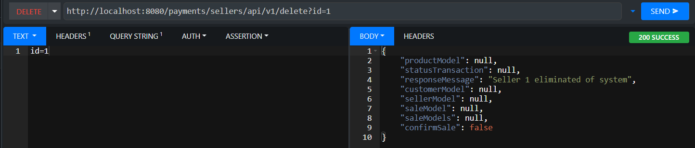

##Sale Operations

###First ABM Sale

The Sale Controller does 3 requested http: (post for add, put for update and delete for delete sales), in the 3 of the required return a JSON JsonResponseTransaction, let's see the restClient examples.

###The request add Sale.

Recibe an object saleModel and response a JsonResponseTransaction across the request POST.
http://localhost:8080/payments/sales/api/v1/add

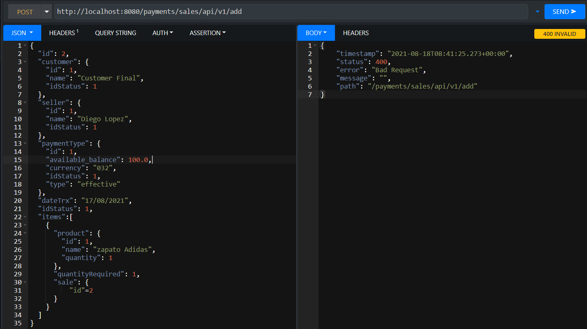

###The request update Sale.

Recibe an object saleModel and response a JsonResponseTransaction across the request PUT.
http://localhost:8080/payments/sales/api/v1/update

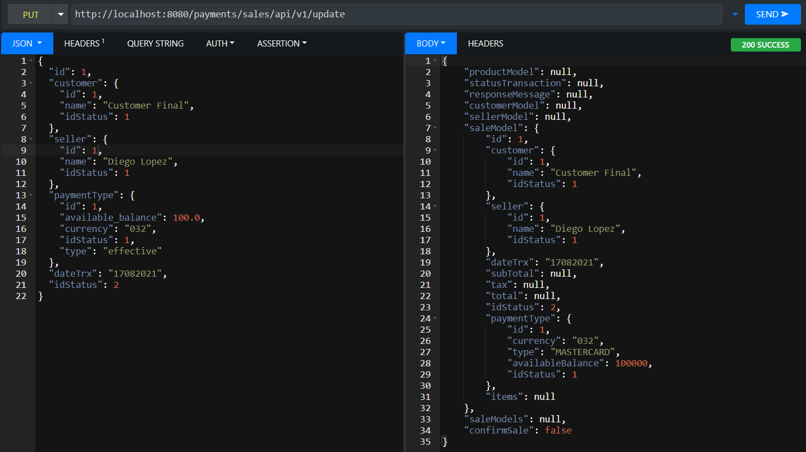

###The request delete Sale.

Recibe an id of type Long and response a JsonResponseTransaction across the request DELETE.
http://localhost:8080/payments/sales/api/v1/delete

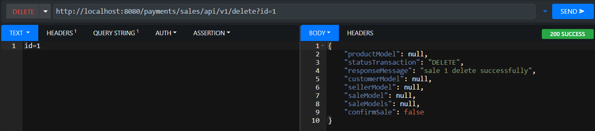

###Second operation order in the sales

In line with the following picture, this describes the sale operation core.

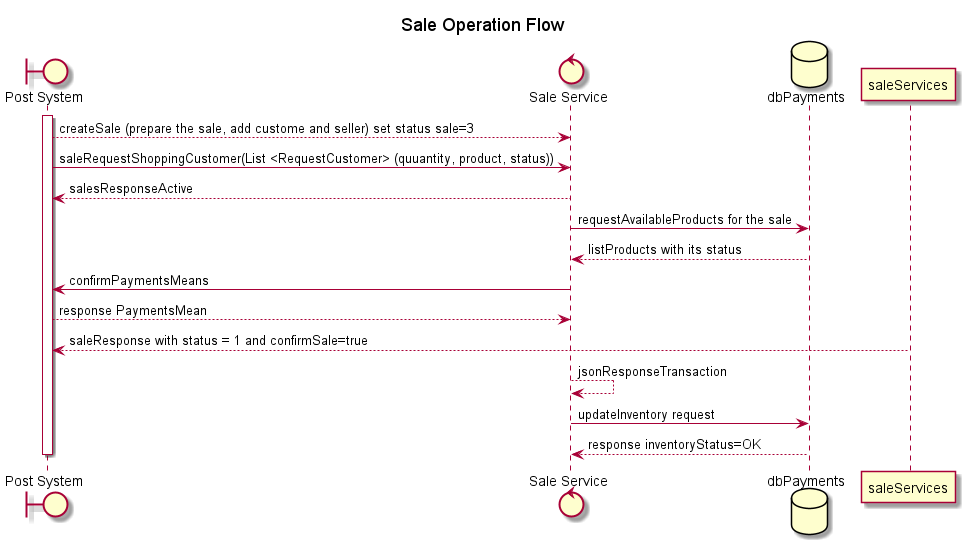

####Create Sale

First the post system receive of JsonRequestSale of the customer then the system creates the sale, that responds across the JSON JsonResponseTransaction, in this moment of the transaction the sale has status=3 what means that the operation is pending status, the payment type is empty or none, really doesn't worry, and the rest of the attributes will be null.
http://localhost:8080/payments/sales/api/v1/create

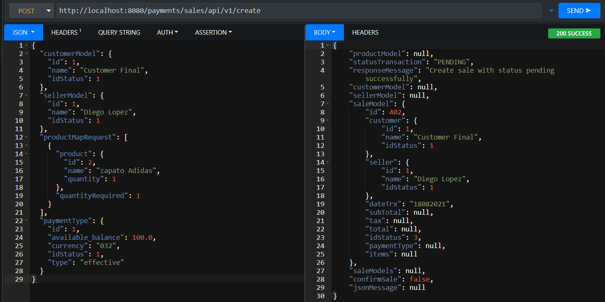

####Verify avaliable products in the confirmSale

Second the post system, verifies the availability of the products required by the customer, regarding the status and quantity of stock of the same in the inventory when it sends the request to confirm sale across of the getProductsAvailableForSale method that receives a JsonRequestSale what provides the initial of the transaction and response a list of available products
http://localhost:8080/payments/sales/api/v1/confirmSale

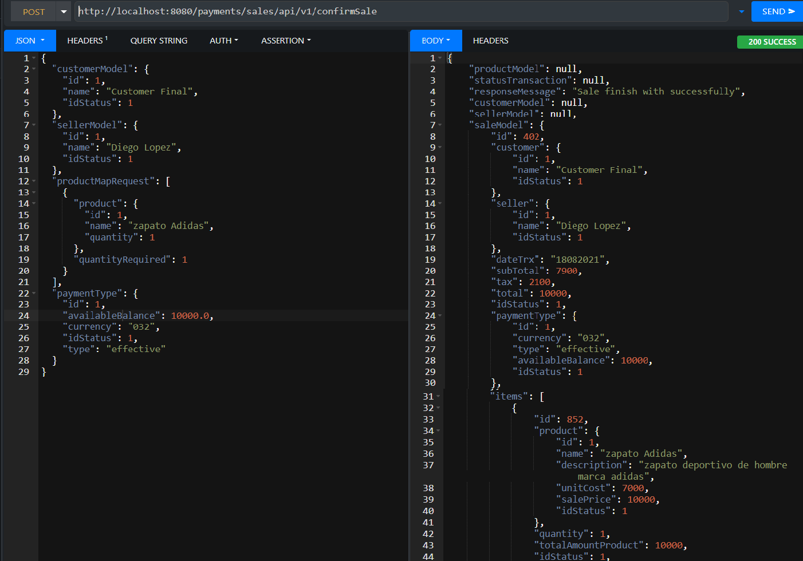

Third, add only the available products to the entity ItemByLine, but has that get of list de requestCustomer the quantity that the customer want of each product and to calculate the amount to pay for the product. In this boucle accumulate the total to pay the all transaction.

Calculate of subTotal and tax of the all transaction and set the items in the saleModel.

It asks the client through the JsonRequestSale the means of payment and the amount available to pay, if the means of payment is enabled and the balance of the customer is greater than the amount to pay, returns true as the confirmation flag of the sale.
http://localhost:8080/payments/sales/api/v1/paymentMean

As can be seen in the previous figure, set a true in the confirmSale flag if the payment method is approved.

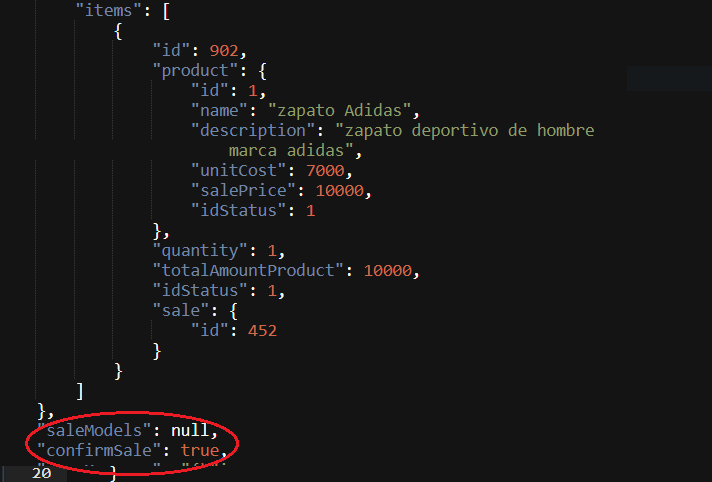

Here the sale transaction ends, finally it is discounted from the inventory if the confirmSale flag is true.

##Query all sales.

The request gets all transactions of sales not get parameters and returns a list of all transactions of sale regardless of its status, pending, active or inactive.
http://localhost:8080/payments/sales/api/v1/saleAll

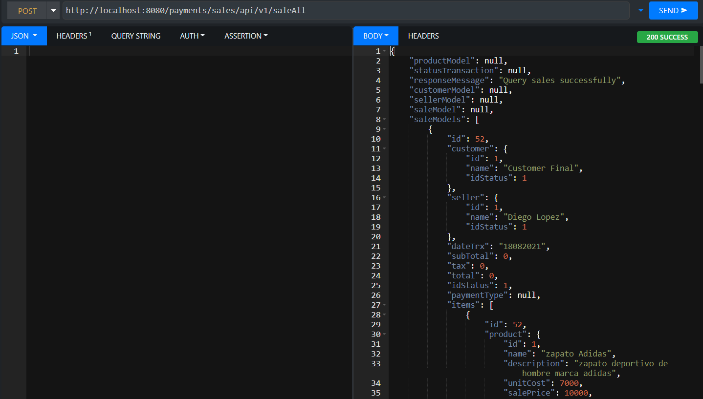

## Sonarqube Evidences

